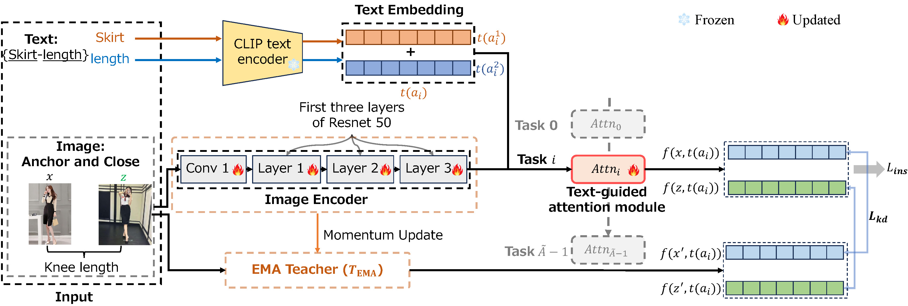

# A Multihead Continual Learning Framework for Fine-Grained Fashion Image Retrieval with Contrastive Learning and Exponential Moving Average Distillation





If you find this work useful in your research, please consider citing:
```bibtex
@article{Xiao_TMM,
  title   = {A Multihead Continual Learning Framework for Fine-Grained Fashion Image Retrieval
             with Contrastive Learning and Exponential Moving Average Distillation},
  author  = {Xiao, Ling and Yamasaki, Toshihiko},
  journal = {IEEE Transactions on Multimedia},
  year    = {2025}
}
